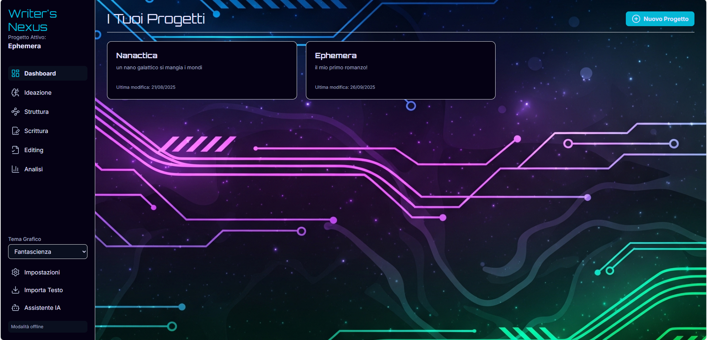
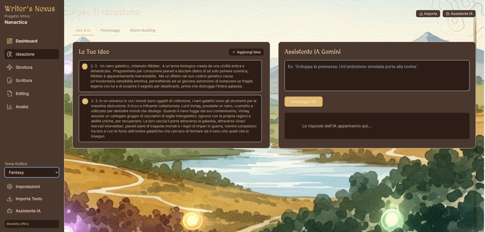
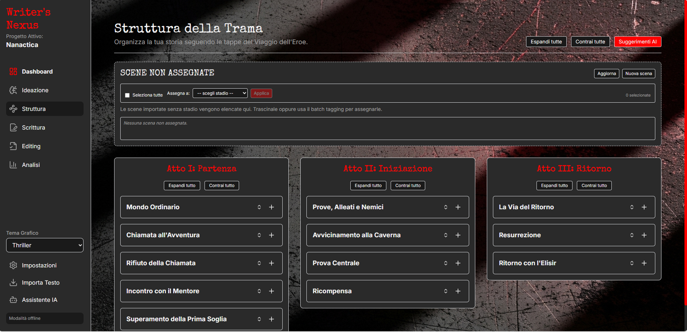
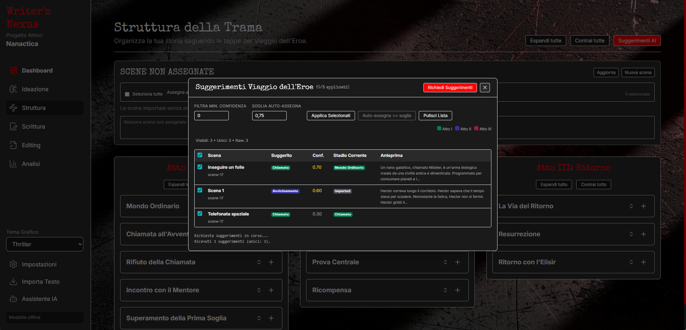
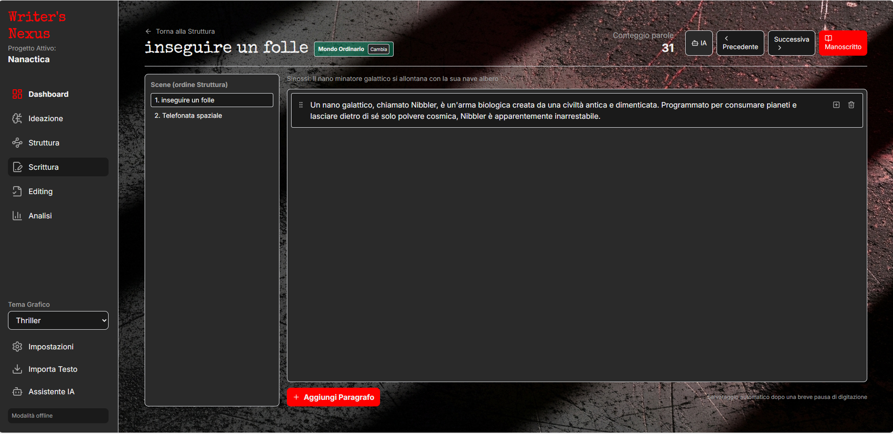

# Writers Nexus

Una suite per la creazione di opere letterarie, dall’idea alla pubblicazione. Ti accompagna in ogni fase — ideazione, organizzazione, scrittura e revisione — con strumenti semplici ma potenti e con il supporto dell’IA, che ti guida passo dopo passo anche se è il tuo primo progetto editoriale.

Funziona direttamente nel browser e anche offline, così puoi lavorare ovunque e in qualsiasi momento; quando desideri, puoi sincronizzare i tuoi lavori nel cloud. L’interfaccia è attualmente in italiano; il rilascio in altre lingue è previsto, a partire dall’inglese.


[](https://github.com/Pioshin/writers-nexus/discussions)
[](https://github.com/Pioshin/writers-nexus/issues)

## Caratteristiche principali

- Ideazione e schede dedicate per personaggi, luoghi, oggetti e sistemi
- Struttura narrativa (Viaggio dell’Eroe) con drag & drop e gestione delle scene non assegnate
- Suggerimenti assistiti dall’IA per inquadrare le scene e trovare ispirazione
- Editor di scrittura con conteggio parole e vista manoscritto a schermo intero
- Dashboard e panoramiche per orientarti nel progetto
- Temi e palette per genere, con interfaccia curata e leggibile
- Dati sempre tuoi: offline‑first con sincronizzazione remota facoltativa

## Caratteristiche (v1.0)

- Importazione testo e segmentazione in scene (senza IA di default)
- Struttura (Viaggio dell’Eroe)
  - Sezione “Scene non assegnate” + batch tagging
  - Drag & drop tra tappe
  - Riordino intra‑stage con campo `order` persistente
  - Badge stage e cambio stage in linea
  - Undo cambio stage (scorciatoia: Ctrl+Alt+Z)
- Suggerimenti IA (Viaggio dell’Eroe)
  - Prompt e parsing robusti (stadi consentiti, IDX, JSON cleaning)
  - Dedup per scena (mantiene confidenza più alta)
  - Filtro per confidenza, selezione, auto‑assegna ≥ soglia
- Scrittura
  - Editor a blocchi con conteggio parole
  - Navigator scene in ordine struttura
  - Badge stage e “Cambia” in linea (Ctrl+Shift+J)
  - Vista “Manoscritto” full screen
- UI/Temi
  - Palette per generi (sci‑fi, fantasy, thriller, romance)
  - Sfondi opachi per massima leggibilità

## Requisiti

- Node.js ≥ 18
- NPM

## Avvio locale

1. Installa le dipendenze
   ```bash
   npm install
   ```
2. Avvia il server di sviluppo
   ```bash
   npm run start
   ```
3. Apri il browser sull’URL mostrato in console (es. http://127.0.0.1:55099)

## Screenshots

> Alcune schermate dell’app (le immagini sono in `docs/screenshots/`).

- Dashboard
  
  

- Ideazione
  
  

- Struttura (con "Scene non assegnate")
  
  

- Suggerimenti IA (modale)
  
  

- Scrittura
  
  

## Configurazioni opzionali

### IA
- Apri Impostazioni → sezione IA.
- Imposta Provider (OpenAI‑compatibile, Ollama, Anthropic, Google), Base URL (se richiesto), Modello, API Key.
- La funzionalità “Suggerimenti Viaggio dell’Eroe” ne farà uso quando richiesta.

### Sincronizzazione (Firebase)
- L’app funziona interamente in locale (IndexedDB). La sincronizzazione remota è facoltativa.
- Per abilitarla, inserisci in Impostazioni le credenziali Firebase (config oggetto) ed effettua login.
- Senza configurazione, l’app resta in Modalità Offline e i dati restano sul tuo dispositivo.

## Limitazioni (v1.0)

- Nessun collegamento obbligatorio al database remoto (sync Firebase opzionale)
- Editing avanzato e Analisi in via di sviluppo
- Undo batch (es. per riordino) non ancora disponibile

## Architettura dati

- Storage locale: IndexedDB (via libreria `idb`), orchestrato da `DataManager`
- Store principali: `projects`, `scenes`, `ideas`, `characters`, `locations`, `objects`, `geography`, `history`, `culture`, `plotlines`, `systems`, `settings`
- `scenes` include `stageKey` (tappa Viaggio dell’Eroe) e `order` (ordinamento intra‑stage)
- Sincronizzazione opzionale con Firestore tramite `FirebaseSync`

## Roadmap

- Migliorie undo/redo (batch, riordino)
- Analisi e editing avanzati
- Esportazione/Importazione progetto JSON

## Community & Contributi

- Partecipa alle [Discussions](https://github.com/Pioshin/writers-nexus/discussions) per idee, domande e feedback.
- Segnala bug in [Issues](https://github.com/Pioshin/writers-nexus/issues).
- Nota: al momento non accettiamo Pull Request esterne.
- Se vuoi supportare il progetto, utilizza il pulsante "Sponsor" visibile nella homepage del repository.

---

Copyright © 2025
